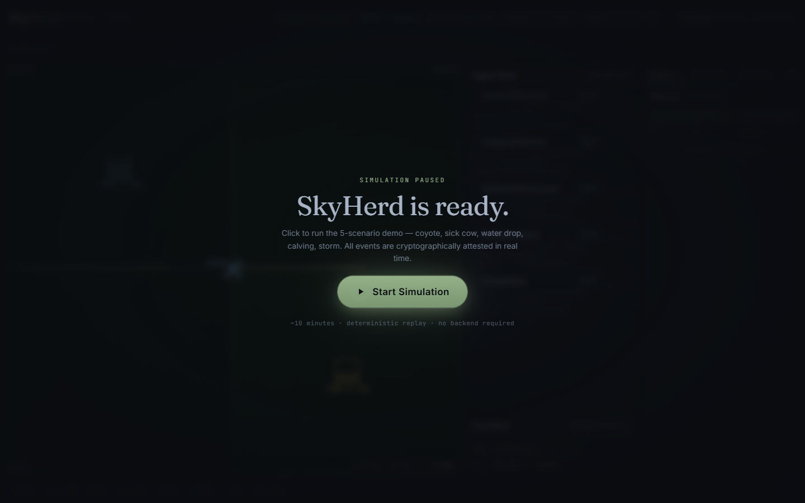

# SkyHerd Engine

[](https://github.com/george11642/skyherd-engine/actions/workflows/ci.yml) [](https://github.com/george11642/skyherd-engine/actions) [](https://github.com/george11642/skyherd-engine/actions) [](LICENSE)

**The nervous system for working land.**

SkyHerd makes a ranch monitor itself — sensors and drones watch the water tanks, the cattle, and the predators around the clock, and the verified record they produce becomes underwriting data that insurance companies and ag-lenders pay for.

Hackathon submission — [Built with Opus 4.7: a Claude Code hackathon](https://cerebralvalley.ai/e/built-with-4-7-hackathon), Apr 21–26 2026. All code in this repo is new, written during the hackathon, MIT licensed.

---

## Quickstart (3 commands)

```bash
git clone https://github.com/george11642/skyherd-engine && cd skyherd-engine
uv sync && (cd web && pnpm install && pnpm run build)
make demo SEED=42 SCENARIO=all    # 5 scenarios, deterministic replay
make dashboard                     # http://localhost:8000
```

## Hardware hero demo (60 seconds)

See **[docs/HARDWARE_DEMO_RUNBOOK.md](docs/HARDWARE_DEMO_RUNBOOK.md)** — runs on 2× Pi 4 + Mavic Air 2, no collar required.

```bash
make hardware-demo    # Pi + Mavic coyote + sick-cow combo
```

---

## Dashboard



> The dashboard screenshot above will be generated by Claude Design. Until then, run `make dashboard` and visit `http://localhost:8000` to see the live SPA: ranch map, 5 agent log lanes, cost ticker, attestation panel, and the `/rancher` PWA with Wes call UI.

---

## What this is

A simulated ranch that monitors itself. Five Claude Managed Agents watch water tanks, cattle, fences, and weather 24/7. The drone auto-launches on predator or water-failure alerts. A tamper-evident Ed25519 Merkle chain logs every event for insurance-grade attestation.

**Sim gate status**: 10/10 items TRULY-GREEN (verified Apr 22 2026 — see [docs/verify-latest.md](docs/verify-latest.md)).

**5 demo scenarios** — all run deterministically with `make demo SEED=42 SCENARIO=all`:
1. Coyote at fence → FenceLineDispatcher → drone → deterrent → Wes call
2. Sick cow flagged → HerdHealthWatcher → vet-intake packet
3. Water tank pressure drop → drone flyover → attestation logged
4. Calving detected → CalvingWatch → rancher page
5. Storm incoming → GrazingOptimizer herd-move → acoustic nudge

---

## Documentation

- [docs/ONE_PAGER.md](docs/ONE_PAGER.md) — start here (2 min read)
- [docs/ARCHITECTURE.md](docs/ARCHITECTURE.md) — nervous-system pattern, data flow, attestation
- [docs/MANAGED_AGENTS.md](docs/MANAGED_AGENTS.md) — $5k prize essay: 5 agents, idle-pause economics, long-idle waits
- [docs/CODEMAP.md](docs/CODEMAP.md) — file-by-file purpose map (generated from tree)
- [docs/HARDWARE_DEMO_RUNBOOK.md](docs/HARDWARE_DEMO_RUNBOOK.md) — 60-second Pi + Mavic hero demo
- [skills/README.md](skills/README.md) — 33-file domain knowledge inventory (CrossBeam pattern)
- [docs/REPLAY_LOG.md](docs/REPLAY_LOG.md) — deterministic scenario replay log

---

## Prize targets

- Top-3 main prizes ($50k / $30k / $10k)
- Best Use of Claude Managed Agents ($5k)
- Keep Thinking ($5k)
- Most Creative Opus 4.7 Exploration ($5k)

---

## Team

George Teifel (UNM, sole registered entrant, [@george11642](https://github.com/george11642)).

## License

MIT. See [LICENSE](./LICENSE).
