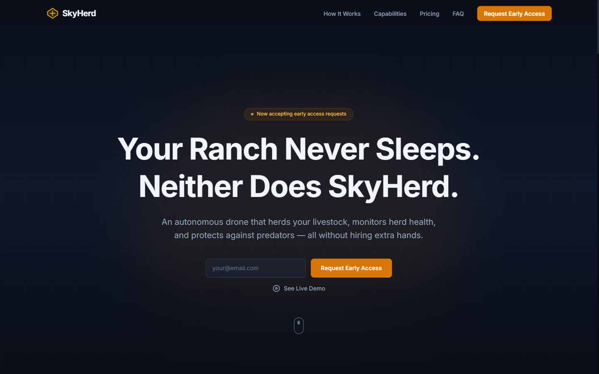
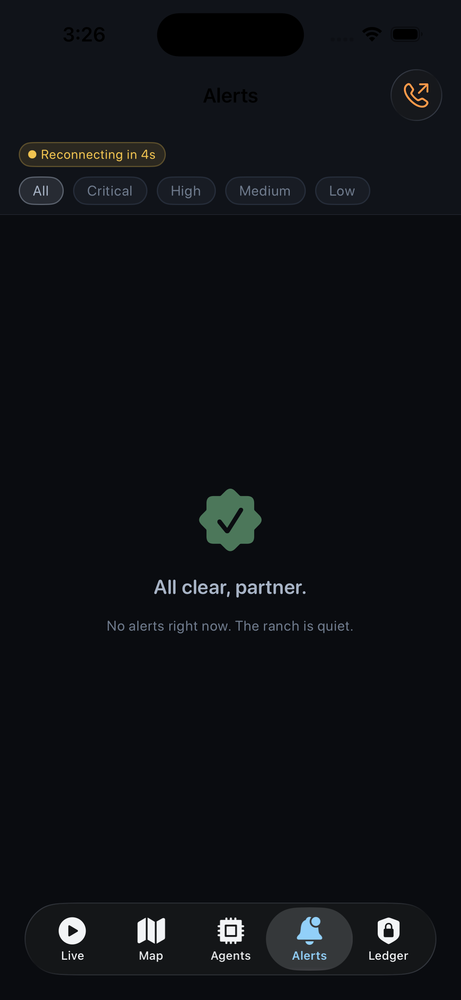
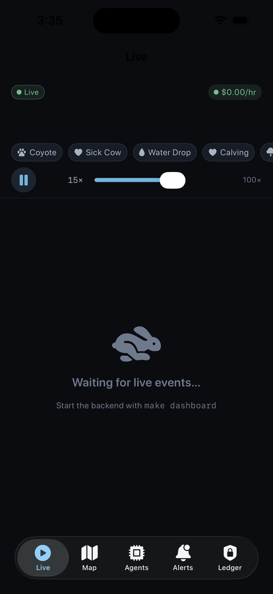
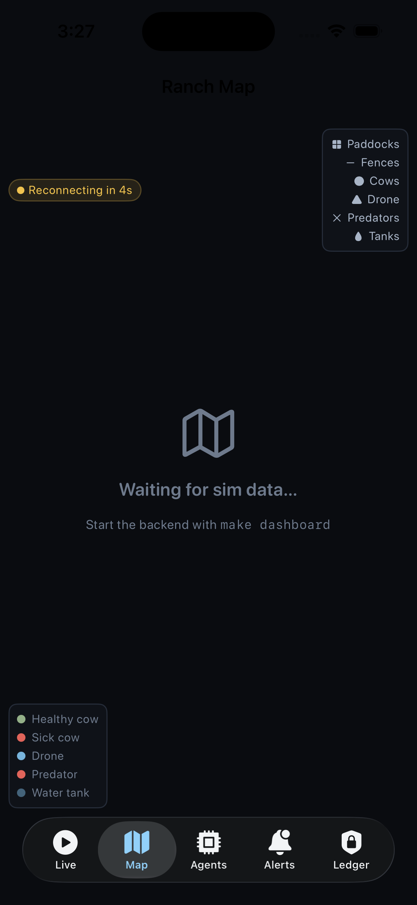
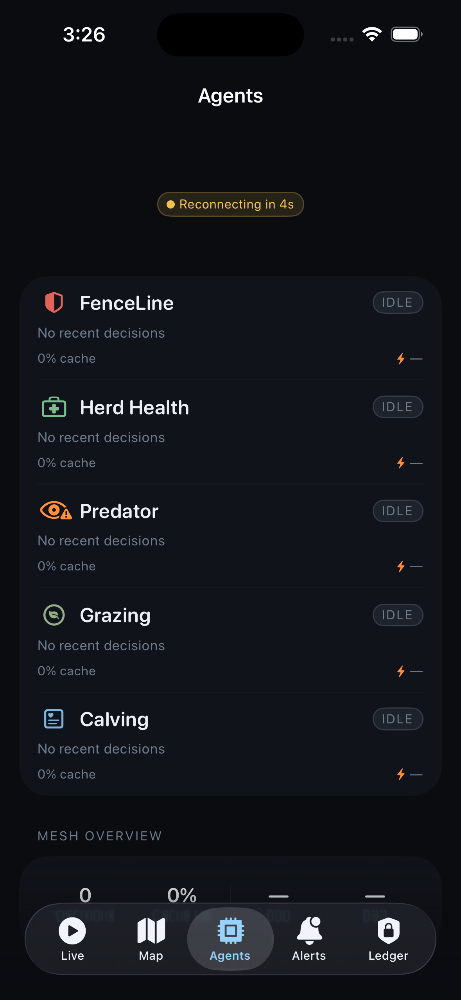

# SkyHerd Engine

**Live demo: https://skyherd-engine.vercel.app** — open on your phone; no install needed.

[](https://github.com/george11642/skyherd-engine/actions/workflows/ci.yml) [](https://github.com/george11642/skyherd-engine/actions) [](https://github.com/george11642/skyherd-engine/actions) [](LICENSE)

**The nervous system for working land.**

SkyHerd makes a ranch monitor itself — sensors and drones watch the water tanks, the cattle, and the predators around the clock, and the verified record they produce becomes underwriting data that insurance companies and ag-lenders pay for.

Hackathon submission — [Built with Opus 4.7: a Claude Code hackathon](https://cerebralvalley.ai/e/built-with-4-7-hackathon), Apr 21–26 2026. All code in this repo is new, written during the hackathon, MIT licensed.

---

## Quickstart (3 commands)

```bash
git clone https://github.com/george11642/skyherd-engine && cd skyherd-engine
uv sync && (cd web && pnpm install && pnpm run build)
make demo SEED=42 SCENARIO=all    # 5 scenarios, deterministic replay
make dashboard                     # http://localhost:8000
```

---

## 3-minute demo

**▶ Watch on YouTube: https://youtu.be/0i1Cu5Hn83A**

The hackathon deliverable is a 3-minute walkthrough of the five scenarios end-to-end, narrated by the "Wes" cowboy persona. Render locally:

```bash
make video-render    # 1080p60, loudnorm -16 LUFS → remotion-video/out/
```

Script + shot list: [docs/DEMO_VIDEO_SCRIPT.md](docs/DEMO_VIDEO_SCRIPT.md) · [docs/SHOT_LIST.md](docs/SHOT_LIST.md). Production pipeline: [docs/DEMO_VIDEO_AUTOMATION.md](docs/DEMO_VIDEO_AUTOMATION.md).

---

## Live site — [skyherd-engine.vercel.app](https://skyherd-engine.vercel.app)



---

## Dashboard — [/demo](https://skyherd-engine.vercel.app/demo)


> Gotham/Lattice/Bloomberg ops-console aesthetic. Ranch map, 5 agent mesh lanes, framer-motion cost ticker, attestation chain, and scenario strip.

---

## Rancher iOS app

<table>
  <tr>
    <td align="center"><br/><sub>Alerts</sub></td>
    <td align="center"><br/><sub>Live</sub></td>
    <td align="center"><br/><sub>Map</sub></td>
    <td align="center"><br/><sub>Agents</sub></td>
    <td align="center"><br/><sub>Ledger</sub></td>
  </tr>
</table>

> Native SwiftUI rancher companion. Alert queue with one-tap acknowledge, live drone telemetry, paddock map with herd density, 5-agent mesh status, attestation ledger viewer.

---

## What this is

A simulated ranch that monitors itself. Five Claude Managed Agents watch water tanks, cattle, fences, and weather 24/7. The drone auto-launches on predator or water-failure alerts. A tamper-evident Ed25519 Merkle chain logs every event for insurance-grade attestation.

**Sim gate status**: 1,106 tests at 87.42% coverage, 16/16 scenario PASSes at `SEED=42`, dashboard HTTP 200 — see [docs/verify-latest.md](docs/verify-latest.md).

**5 demo scenarios** — all run deterministically with `make demo SEED=42 SCENARIO=all`:
1. Coyote at fence → FenceLineDispatcher → drone → deterrent → Wes call
2. Sick cow flagged → HerdHealthWatcher → vet-intake packet
3. Water tank pressure drop → drone flyover → attestation logged
4. Calving detected → CalvingWatch → rancher page
5. Storm incoming → GrazingOptimizer herd-move → acoustic nudge

---

## Build commands

| Target | Purpose |
|---|---|
| `make demo SEED=42 SCENARIO=all` | All 5 scenarios back-to-back, deterministic replay |
| `make dashboard` | FastAPI + SSE + built SPA at `:8000` |
| `make mesh-smoke` | 5-agent Managed Agents mesh smoke (stubs SDK without `ANTHROPIC_API_KEY`) |
| `make video-render` | Final 1080p60 demo render |
| `make test` / `make ci` | pytest+cov / lint + typecheck + test (CI mirror) |

---

## Documentation

- [docs/ONE_PAGER.md](docs/ONE_PAGER.md) — start here (2 min read)
- [docs/ARCHITECTURE.md](docs/ARCHITECTURE.md) — nervous-system pattern, data flow, attestation
- [docs/MANAGED_AGENTS.md](docs/MANAGED_AGENTS.md) — $5k prize essay: 5 agents, idle-pause economics, long-idle waits
- [docs/CODEMAP.md](docs/CODEMAP.md) — file-by-file purpose map
- [docs/ATTESTATION.md](docs/ATTESTATION.md) — Ed25519 Merkle ledger + offline verifier
- [skills/README.md](skills/README.md) — 33-file domain knowledge inventory (CrossBeam pattern)
- [docs/REPLAY_LOG.md](docs/REPLAY_LOG.md) — deterministic scenario replay log
- [docs/DESIGN_SYSTEM.md](docs/DESIGN_SYSTEM.md) — token system, typography, components, motion + a11y rules
- [docs/SUBMISSION.md](docs/SUBMISSION.md) — Devpost submission packet

---

## Hardware (Year-2 reference)

The submission ships sim-only. The hardware topology — 1× Raspberry Pi 4 (`edge-house`, MegaDetector at troughs 1–6), 1× Intel Galileo (`edge-tank`, water-tank telemetry), 1× DJI Mavic Air 2 — is documented and runnable for Year-2 deployment but not filmed for the hackathon cut:

- [docs/HARDWARE_PI_FLEET.md](docs/HARDWARE_PI_FLEET.md) — Pi camera-edge runbook
- [docs/HARDWARE_GALILEO.md](docs/HARDWARE_GALILEO.md) — Galileo water-tank runbook
- [docs/HARDWARE_DEMO_RUNBOOK.md](docs/HARDWARE_DEMO_RUNBOOK.md) — `make hardware-demo` 60-second on-camera path

---

## Prize targets

- Top-3 main prizes ($50k / $30k / $10k)
- Best Use of Claude Managed Agents ($5k)
- Keep Thinking ($5k)
- Most Creative Opus 4.7 Exploration ($5k)

---

## Team

George Teifel (UNM, sole registered entrant, [@george11642](https://github.com/george11642)).

## License

MIT. See [LICENSE](./LICENSE).
