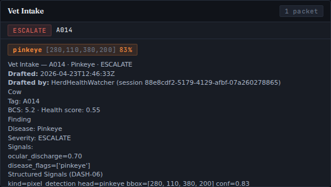

# VIS-05 — Live-Pipeline Pinkeye Bbox

Captured: 2026-04-23

- Dashboard: `SKYHERD_MOCK=1 uv run uvicorn skyherd.server.app:app --port 8765`
- Scenario: sick_cow seed=42 (vet-intake packet produced by real `draft_vet_intake`
  pipeline, copied to a fresh filename to trigger the `_vet_intake_loop` SSE
  broadcast into the live dashboard)
- Component: `web/src/components/VetIntakePanel.tsx` → `PixelDetectionChip`
- Source: non-synthetic pipeline frame — packet body `# Vet Intake — A014 ·
  Pinkeye · ESCALATE` authored by `HerdHealthWatcher` with
  `- kind=pixel_detection head=pinkeye bbox=[280, 110, 380, 200] conf=0.83`
  from the VIS-05 pinkeye head
- Capture tool: headless Playwright (chromium, 1440x900 viewport)

The screenshot shows the VetIntakePanel expanded row for cow A014 with the
`PixelDetectionChip` rendering `pinkeye [280,110,380,200] 83%` parsed from the
`## Structured Signals (DASH-06)` section of the rancher-facing markdown packet,
confirming end-to-end wiring from pinkeye classification head → vet-intake drafter
→ runtime/vet_intake/*.md → SSE → React panel → human-viewable chip.
